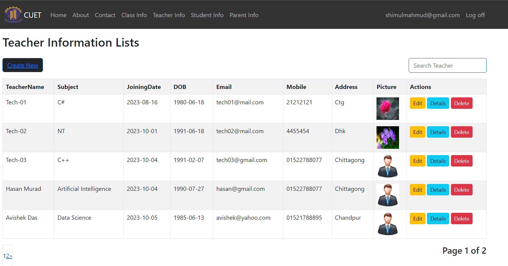
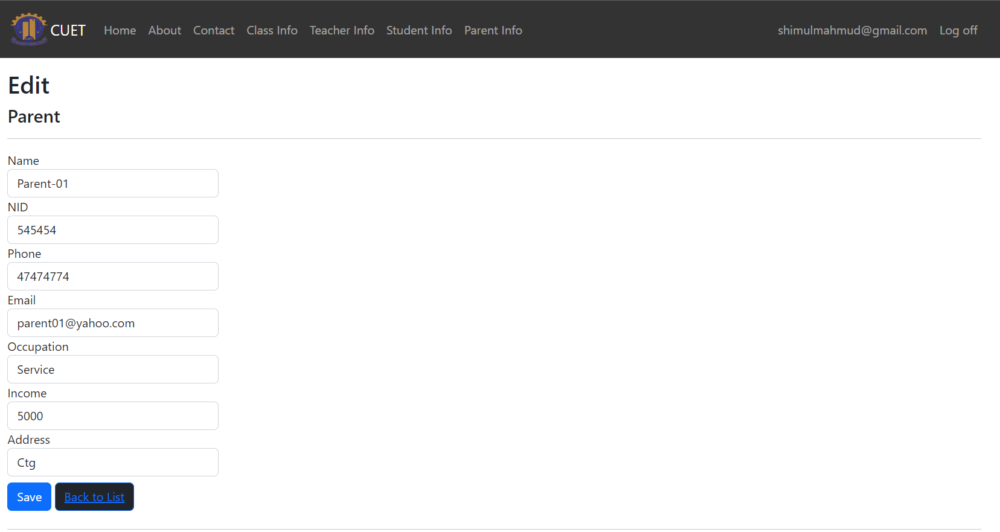
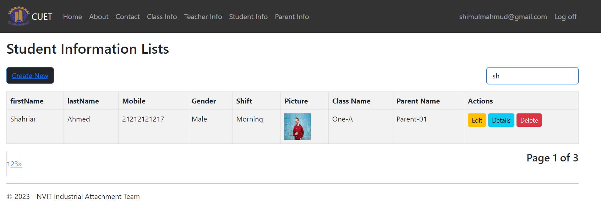

# Information Management System for Educational Institution

An Information Management System (IMS) for an educational institution involves building a comprehensive platform that can handle various aspects of educational administration, student information, teacher information, and so on.

## Table of Contents

- [Introduction](#introduction)
- [Technologies Used](#technologies-used)
- [Prerequisites](#prerequisites)
- [Installation](#installation)
- [Features](#features)
- [Components](#components)
  - [Home](#home)
  - [Contact](#contact)
  - [About](#about)
  - [Class Information](#class-information)
  - [Student Information](#student-information)
  - [Teacher Information](#teacher-information)
  - [Parent Information](#parent-information)
  - [Create New Information](#create-new-information)
  - [Register](#register)
  - [Login](#login)
  - [Edit Information](#edit-information)
  - [Details Information](#details-information)
  - [Delete Information](#delete-information)
  - [Pagination](#pagination)
  - [Searching](#searching)
  - [Validation](#validation)
  - [Image Uploading](#image-uploading)

## Introduction

This ASP.NET MVC project is designed to demonstrate a fully-featured web application with a variety of functionalities, catering to different user roles and use cases. The project's primary goal is to illustrate best practices in web development.

This ASP.NET MVC project is a comprehensive web application that covers various features including user authentication, authorization, CRUD operations, image uploading, pagination, searching, and more.

## Technologies Used

- **ASP.NET MVC**: The core web framework.
- **Entity Framework**: Object-Relational Mapping for database interaction.
- **HTML, CSS, JavaScript**: Front-end technologies.
- **SQL Server**: Database for data storage.
- **Authentication Library**: Used for user authentication.
- **Responsive Design**: Ensuring a user-friendly experience on desktop,laptop and tablets.

## Prerequisites

Before running the project, ensure you have the following installed:

- [.NET Framework SDK](https://dotnet.microsoft.com/download)
- [Visual Studio](https://visualstudio.microsoft.com/) or a suitable IDE.
- [SQL Server](https://www.microsoft.com/en-us/sql-server/sql-server-downloads)

## Installation

Follow these steps to run the project locally:

1. Clone the repository:

   ```bash
   git clone https://github.com/MdShimulMahmud/information-management-system-for-educational-institution.git
   cd your-project-directory
   ```

2. Run project:
   ```bash
   open project with visual studio 2022
   debug -> start without debugging
   ```

## Features

- **Home**: The application's landing page.
- **Contact**: A page featuring a contact form for user inquiries and feedback.
- **About**: Information about the project, its goals, and contributors.
- **Class Info**: Manage and display information about classes.
- **Student Info**: Manage and display student data.
- **Teacher Info**: Manage and display teacher information.
- **Parent Info**: Manage and display parent data.
- **Register**: User registration with validation.
- **Login**: User login and authentication.

The project also includes the following features:

- **Authentication and Authorization**: User registration, login, and role-based access control.
- **Pagination**: Navigate through paginated data.
- **Searching**: Search for specific data quickly.
- **Validation**: Data validation to ensure accuracy.
- **Image Uploading**: Allow users to upload and manage images.

<!-- ## Demo


View a live demo of the project [here](#). -->

## Components

These are the basic components of our developed projects.

### Home


### About


### Contact


### Class Information

- Unregistered users can't see the information.User must be registered to see information.
  

### Teacher Information

- Unregistered users can't see the information.User must be registered to see information.
  

### Student Information

- Unregistered users can't see the information.User must be registered to see information.
  

### Parent Information

- Unregistered users can't see the information.User must be registered to see information.
  

### Create New Information

- Only a registered user can create an information.
  

### Login


### Register


### Edit Information

- Role-based access only. Only manager and officer got access to edit information.

  

### Details Information

- Role-based access only. Anyone shows the details.

  

### Delete Information

- Role-based access only. Only manager got access to delete information.

  

### Image Uploading

- Choose file contains an image uploading option.

  

### Validation

- Every Input Field is validated.
- When someone will be trying to create a new information of any student, teacher, class and parent information, he must be inputed the valid information, otherwise it shows the error message.

  

### Searching

- The search results showing based on the input typed by the user within search box.

  

### Pagination

- In a single page, it consists only five information lists. The pagination shows on the bottom-left and bottom-right corner.

  
